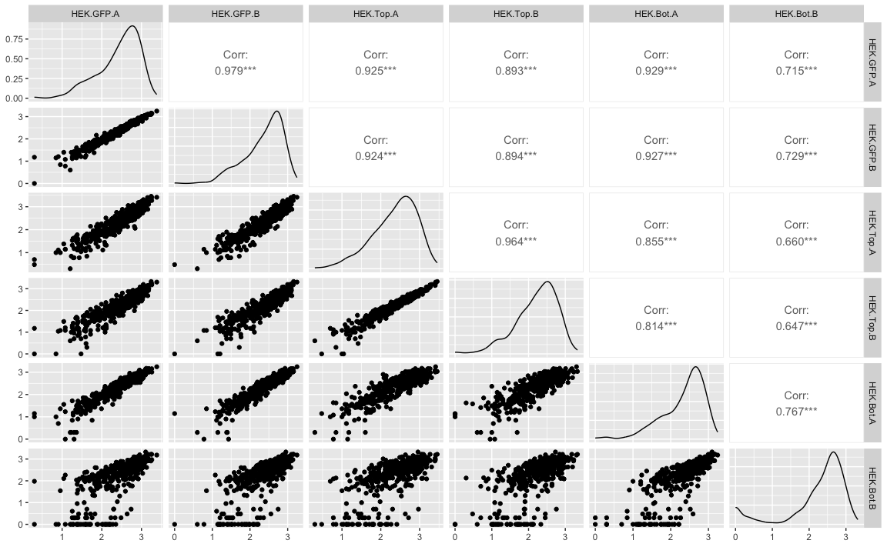
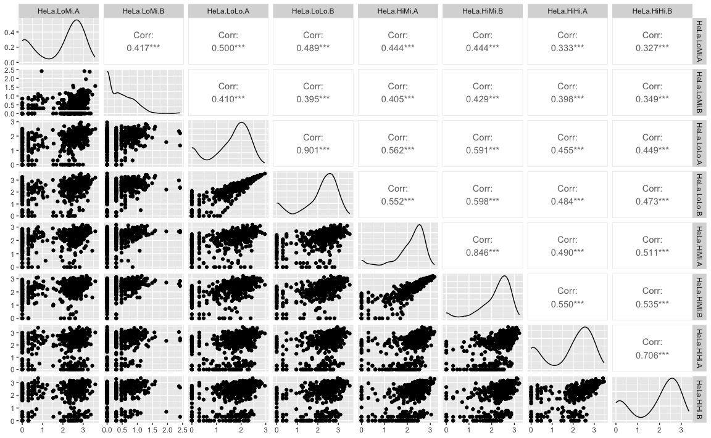
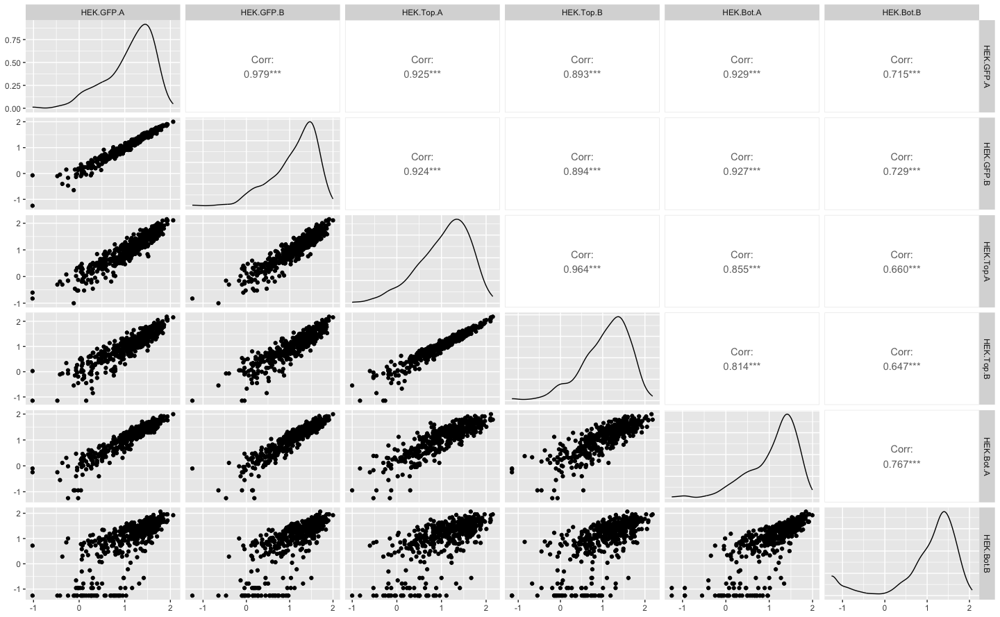
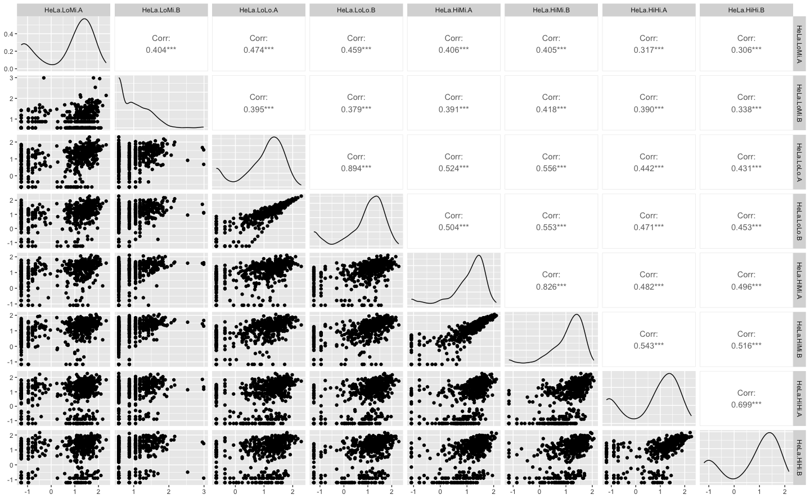
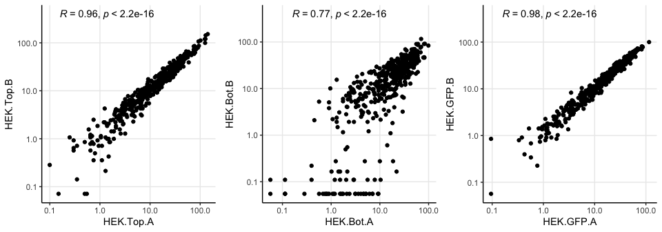
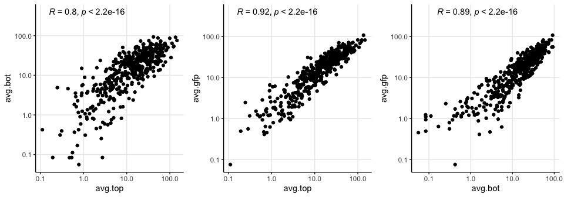
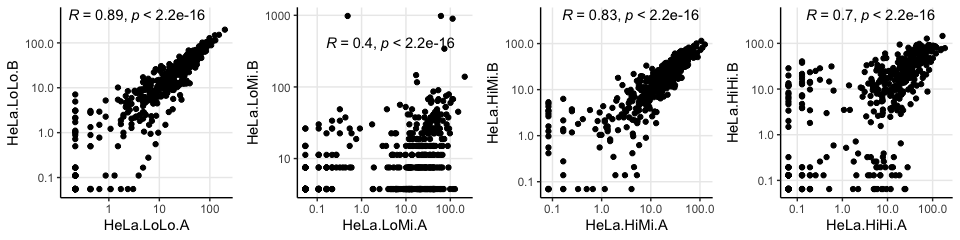
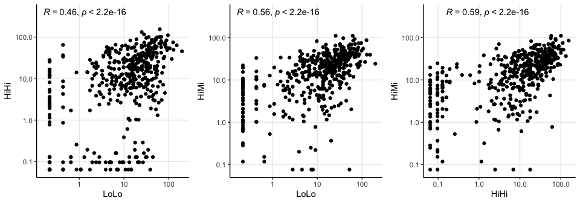

Pilot screen analysis
================
Kaspar Bresser

- [Import and inspect](#import-and-inspect)
- [correlation](#correlation)
- [Filtering](#filtering)
- [Compare samples](#compare-samples)

## Import and inspect

Import read counts

``` r
readcounts <- read_tsv("./output_all_filtered.tsv")

readcounts
```

    ## # A tibble: 472 × 15
    ##    ...1     Output/aligned/filte…¹ Output/aligned/filte…² Output/aligned/filte…³
    ##    <chr>                     <dbl>                  <dbl>                  <dbl>
    ##  1 oligo_0…                     51                     56                     12
    ##  2 oligo_0…                    299                    293                    120
    ##  3 oligo_0…                     16                     24                      6
    ##  4 oligo_0…                     38                     32                     25
    ##  5 oligo_0…                   1403                   1156                   1347
    ##  6 oligo_0…                     25                     19                     12
    ##  7 oligo_0…                     97                     82                    179
    ##  8 oligo_0…                    562                    567                    794
    ##  9 oligo_0…                   1025                   1037                   1049
    ## 10 oligo_0…                    762                    585                    521
    ## # ℹ 462 more rows
    ## # ℹ abbreviated names: ¹​`Output/aligned/filtered/filtered_1A_R2.sam`,
    ## #   ²​`Output/aligned/filtered/filtered_1B_R2.sam`,
    ## #   ³​`Output/aligned/filtered/filtered_2A_R2.sam`
    ## # ℹ 11 more variables: `Output/aligned/filtered/filtered_2B_R2.sam` <dbl>,
    ## #   `Output/aligned/filtered/filtered_3A_R2.sam` <dbl>,
    ## #   `Output/aligned/filtered/filtered_3B_R2.sam` <dbl>, …

update column names

``` r
colnames(readcounts) <-  c("Motif", "HEK.GFP.A","HEK.GFP.B", 
                                   "HEK.Top.A","HEK.Top.B", 
                                   "HEK.Bot.A","HEK.Bot.B", 
                                   "HeLa.LoMi.A", "HeLa.LoMi.B", 
                                   "HeLa.LoLo.A", "HeLa.LoLo.B", 
                                   "HeLa.HiMi.A", "HeLa.HiMi.B",
                                   "HeLa.HiHi.A", "HeLa.HiHi.B"  ) 

readcounts
```

    ## # A tibble: 472 × 15
    ##    Motif HEK.GFP.A HEK.GFP.B HEK.Top.A HEK.Top.B HEK.Bot.A HEK.Bot.B HeLa.LoMi.A
    ##    <chr>     <dbl>     <dbl>     <dbl>     <dbl>     <dbl>     <dbl>       <dbl>
    ##  1 olig…        51        56        12         7        22        42           0
    ##  2 olig…       299       293       120       102       552       612           5
    ##  3 olig…        16        24         6         9         1         0           1
    ##  4 olig…        38        32        25        14        29         0         158
    ##  5 olig…      1403      1156      1347       782      1208      1376         818
    ##  6 olig…        25        19        12        14        17         2           0
    ##  7 olig…        97        82       179       192        22       280           2
    ##  8 olig…       562       567       794       586       670       577         415
    ##  9 olig…      1025      1037      1049       681      1055       925        1278
    ## 10 olig…       762       585       521       413       659       589        2358
    ## # ℹ 462 more rows
    ## # ℹ 7 more variables: HeLa.LoMi.B <dbl>, HeLa.LoLo.A <dbl>, HeLa.LoLo.B <dbl>,
    ## #   HeLa.HiMi.A <dbl>, HeLa.HiMi.B <dbl>, HeLa.HiHi.A <dbl>, HeLa.HiHi.B <dbl>

Lets keep only the stuff we’ll need, and add a numeric identifier.

``` r
readcounts %>% 
  filter(!str_detect(Motif, "__")) %>% 
  summarise(.,
            across(where(is.numeric), sum),
            across(where(is.character), ~"__aligned")) %>% 
  bind_rows(readcounts) -> readcounts

readcounts
```

    ## # A tibble: 473 × 15
    ##    HEK.GFP.A HEK.GFP.B HEK.Top.A HEK.Top.B HEK.Bot.A HEK.Bot.B HeLa.LoMi.A
    ##        <dbl>     <dbl>     <dbl>     <dbl>     <dbl>     <dbl>       <dbl>
    ##  1    209900    176084    200407    140258    176534    181217      184939
    ##  2        51        56        12         7        22        42           0
    ##  3       299       293       120       102       552       612           5
    ##  4        16        24         6         9         1         0           1
    ##  5        38        32        25        14        29         0         158
    ##  6      1403      1156      1347       782      1208      1376         818
    ##  7        25        19        12        14        17         2           0
    ##  8        97        82       179       192        22       280           2
    ##  9       562       567       794       586       670       577         415
    ## 10      1025      1037      1049       681      1055       925        1278
    ## # ℹ 463 more rows
    ## # ℹ 8 more variables: HeLa.LoMi.B <dbl>, HeLa.LoLo.A <dbl>, HeLa.LoLo.B <dbl>,
    ## #   HeLa.HiMi.A <dbl>, HeLa.HiMi.B <dbl>, HeLa.HiHi.A <dbl>, HeLa.HiHi.B <dbl>,
    ## #   Motif <chr>

``` r
readcounts %>% 
  filter(str_detect(Motif, "__")) %>% 
  pivot_longer(cols = contains("."), names_to = "sample", values_to = "reads") %>%
  filter(!(reads == 0)) %>% 
  ggplot(aes(x = sample, y = reads, fill = fct_rev(Motif)))+
  geom_bar(stat = "identity", position = "fill", color = "black", width = .8)+
  theme_classic()+
  theme(panel.grid.major.y = element_line(), axis.text.x=element_text(angle=45,hjust=1))
```


Keep only the aligned reads

``` r
readcounts %>% 
  filter(!str_detect(Motif, "__"))  -> aligned

write_tsv(aligned, "./Output/RE_013_readcounts_filt.tsv")
```

## correlation

``` r
ggpairs(log10(aligned[1:6]+1))
```



``` r
ggsave("./Figs/cor_plots_HEK.png", width = 6, height = 5, scale = 1.5)

ggpairs(log10(aligned[7:14]+1))
```



``` r
ggsave("./Figs/cor_plots_HeLa.png", width = 6, height = 5, scale = 1.5)
```

## Filtering

HEK

``` r
aligned %>%
  select(Motif, contains("HEK")) %>% 
  rowwise() %>%
  filter(sum(c_across(2:7)) > 10) %>%
  ungroup() %>%
  mutate(across(where(is.numeric), ~.+1),
         across(where(is.numeric), ~./sum(.))*10000) %>%
  mutate(avg.top = ( HEK.Top.A + HEK.Top.B)/2,
         avg.bot = (HEK.Bot.A + HEK.Bot.B)/2,
         avg.gfp = (HEK.GFP.A + HEK.GFP.B)/2) -> aligned.HEK


write_tsv(aligned.HEK, "./Output/RE_013_HEK_normalized.tsv")


ggpairs(log10(aligned.HEK[2:7]))
```



``` r
ggsave("./Figs/cor_plots_normalized_HEK.png", width = 12, height = 11, scale = 1.5)
```

HeLa

``` r
aligned %>%
  select(Motif, contains("HeLa")) %>% 
  rowwise() %>%
  filter(sum(c_across(2:7)) > 10) %>%
  ungroup() %>%
  mutate(across(where(is.numeric), ~.+1),
         across(where(is.numeric), ~./sum(.))*10000) %>%
  mutate(LoMi = ( HeLa.LoMi.A + HeLa.LoMi.B)/2,
         LoLo = (HeLa.LoLo.A + HeLa.LoLo.A)/2,
         HiMi = (HeLa.HiMi.A + HeLa.HiMi.B)/2,
         HiHi = (HeLa.HiHi.A + HeLa.HiHi.B)/2) -> aligned.HeLa


write_tsv(aligned.HeLa, "./Output/RE_013_HeLa_normalized.tsv")


ggpairs(log10(aligned.HeLa[2:9]))
```



``` r
ggsave("./Figs/cor_plots_normalized_HeLa.png", width = 12, height = 11, scale = 1.5)
```

## Compare samples

Compare half-samples HEK

``` r
var.list1 <- list("HEK.Top.A", "HEK.Bot.A", "HEK.GFP.A")
var.list2 <- list("HEK.Top.B", "HEK.Bot.B", "HEK.GFP.B")

p.list <- map2( var.list1,
                var.list2, 
                ~ggplot(aligned.HEK, aes(.data[[.x]], .data[[.y]]))+
                    geom_point()+
                    scale_y_log10()+
                    scale_x_log10()+
                    theme_classic()+
                    theme(panel.grid.major = element_line())  +
                    stat_cor(method = "pearson", label.x = -.8, label.y = 2.6)
                )

ggarrange(plotlist = p.list, nrow = 1)
```



``` r
ggsave("./Figs/scatter_halfsamples_HEK.pdf", width = 9, height = 3)
```

Use the averages of the half-samples to compare the experimental samples

``` r
var.list1 <- list("avg.top", "avg.top", "avg.bot")
var.list2 <- list("avg.bot", "avg.gfp", "avg.gfp")

p.list <- map2( var.list1,
                var.list2, 
                ~ggplot(aligned.HEK, aes(.data[[.x]], .data[[.y]]))+
                    geom_point()+
                    scale_y_log10()+
                    scale_x_log10()+
                    theme_classic()+
                    theme(panel.grid.major = element_line()) +
                    stat_cor(method = "pearson", label.x = -.8, label.y = 2.6)
                )

ggarrange(plotlist = p.list, ncol = 3)
```



``` r
ggsave("./Figs/scattter_experimental_HEK.pdf", width = 9, height = 3)
```

Compare half-samples HeLa

``` r
var.list1 <- list("HeLa.LoLo.A", "HeLa.LoMi.A", "HeLa.HiMi.A", "HeLa.HiHi.A")
var.list2 <- list("HeLa.LoLo.B", "HeLa.LoMi.B", "HeLa.HiMi.B","HeLa.HiHi.B")

p.list <- map2( var.list1,
                var.list2, 
                ~ggplot(aligned.HeLa, aes(.data[[.x]], .data[[.y]]))+
                    geom_point()+
                    scale_y_log10()+
                    scale_x_log10()+
                    theme_classic()+
                    theme(panel.grid.major = element_line())  +
                    stat_cor(method = "pearson", label.x = -.8, label.y = 2.6)
                )

ggarrange(plotlist = p.list, nrow = 1)
```



``` r
ggsave("./Figs/scatter_halfsamples_HeLa.pdf", width = 12, height = 3)
```

Use the averages of the half-samples to compare the experimental samples

``` r
var.list1 <- list("LoLo", "LoLo", "HiHi")
var.list2 <- list("HiHi", "HiMi", "HiMi")

p.list <- map2( var.list1,
                var.list2, 
                ~ggplot(aligned.HeLa, aes(.data[[.x]], .data[[.y]]))+
                    geom_point()+
                    scale_y_log10()+
                    scale_x_log10()+
                    theme_classic()+
                    theme(panel.grid.major = element_line()) +
                    stat_cor(method = "pearson", label.x = -.8, label.y = 2.6)
                )

ggarrange(plotlist = p.list, ncol = 3)
```



``` r
ggsave("./Figs/scattter_experimental_HeLa.pdf", width = 9, height = 3)
```
