Motif analysis 3’UTR screen T cells
================
Kaspar Bresser

- [HEK](#hek)
  - [Test for enriched trimers](#test-for-enriched-trimers)
    - [Visualize](#visualize)
  - [Test for dimers](#test-for-dimers)
    - [Visualize](#visualize-1)
  - [Content analysis](#content-analysis)
- [HeLa](#hela)
  - [Test for enriched trimers](#test-for-enriched-trimers-1)
    - [Visualize](#visualize-2)
  - [Test for dimers](#test-for-dimers-1)
    - [Visualize](#visualize-3)
  - [Content analysis](#content-analysis-1)

# HEK

``` r
aligned <- read_tsv("./Output/RE_013_HEK_normalized.tsv")

aligned
```

    ## # A tibble: 467 × 10
    ##    Motif     HEK.GFP.A HEK.GFP.B HEK.Top.A HEK.Top.B HEK.Bot.A HEK.Bot.B avg.top
    ##    <chr>         <dbl>     <dbl>     <dbl>     <dbl>     <dbl>     <dbl>   <dbl>
    ##  1 oligo_00…     2.47       3.23     0.647     0.568     1.30     2.37     0.608
    ##  2 oligo_00…    14.3       16.7      6.02      7.32     31.2     33.7      6.67 
    ##  3 oligo_00…     0.808      1.42     0.348     0.711     0.113    0.0550   0.530
    ##  4 oligo_00…     1.85       1.87     1.29      1.07      1.69     0.0550   1.18 
    ##  5 oligo_00…    66.7       65.5     67.1      55.6      68.3     75.8     61.4  
    ##  6 oligo_00…     1.24       1.13     0.647     1.07      1.02     0.165    0.857
    ##  7 oligo_00…     4.66       4.70     8.96     13.7       1.30    15.5     11.3  
    ##  8 oligo_00…    26.8       32.2     39.6      41.7      37.9     31.8     40.6  
    ##  9 oligo_00…    48.8       58.8     52.3      48.5      59.7     51.0     50.4  
    ## 10 oligo_01…    36.3       33.2     26.0      29.4      37.3     32.5     27.7  
    ## # ℹ 457 more rows
    ## # ℹ 2 more variables: avg.bot <dbl>, avg.gfp <dbl>

## Test for enriched trimers

Get all possible trimers

``` r
x <- expand.grid(rep(list(c('A', 'G', 'T', 'C')), 3))
x <- do.call(paste0, x)

x 
```

    ##  [1] "AAA" "GAA" "TAA" "CAA" "AGA" "GGA" "TGA" "CGA" "ATA" "GTA" "TTA" "CTA"
    ## [13] "ACA" "GCA" "TCA" "CCA" "AAG" "GAG" "TAG" "CAG" "AGG" "GGG" "TGG" "CGG"
    ## [25] "ATG" "GTG" "TTG" "CTG" "ACG" "GCG" "TCG" "CCG" "AAT" "GAT" "TAT" "CAT"
    ## [37] "AGT" "GGT" "TGT" "CGT" "ATT" "GTT" "TTT" "CTT" "ACT" "GCT" "TCT" "CCT"
    ## [49] "AAC" "GAC" "TAC" "CAC" "AGC" "GGC" "TGC" "CGC" "ATC" "GTC" "TTC" "CTC"
    ## [61] "ACC" "GCC" "TCC" "CCC"

Define function that tests for motifs that are significantly enriched or
depleted, and extracts their log2 fold changes.

``` r
get_stats <- function(seq){
  
  aligned %>% 
    mutate(log2topVSbot = log2(avg.top/avg.bot)) %>% 
    filter(str_detect(Motif, seq) ) %>% 
    mutate(seq = seq) %>% 
    select(log2topVSbot, seq) -> tmp
    
  aligned %>% 
    mutate(log2topVSbot = log2(avg.top/avg.bot)) %>% 
      mutate(contains.seq = as.factor(case_when(str_detect(Motif, seq) ~ "yes", TRUE ~ "no"))) %>% 
    wilcox_test(log2topVSbot~contains.seq) %>% 
    mutate(seq = seq) %>% 
    inner_join(tmp)
}
```

Run function for all motifs.

``` r
wilcox.seqs <- map_dfr(x, get_stats)

wilcox.seqs
```

    ## # A tibble: 1,762 × 9
    ##    .y.          group1 group2    n1    n2 statistic      p seq   log2topVSbot
    ##    <chr>        <chr>  <chr>  <int> <int>     <dbl>  <dbl> <chr>        <dbl>
    ##  1 log2topVSbot no     yes      430    37      9424 0.0623 AAA        -1.59  
    ##  2 log2topVSbot no     yes      430    37      9424 0.0623 AAA         0.525 
    ##  3 log2topVSbot no     yes      430    37      9424 0.0623 AAA        -1.65  
    ##  4 log2topVSbot no     yes      430    37      9424 0.0623 AAA        -1.05  
    ##  5 log2topVSbot no     yes      430    37      9424 0.0623 AAA        -1.00  
    ##  6 log2topVSbot no     yes      430    37      9424 0.0623 AAA        -0.141 
    ##  7 log2topVSbot no     yes      430    37      9424 0.0623 AAA        -1.14  
    ##  8 log2topVSbot no     yes      430    37      9424 0.0623 AAA         0.0246
    ##  9 log2topVSbot no     yes      430    37      9424 0.0623 AAA        -0.802 
    ## 10 log2topVSbot no     yes      430    37      9424 0.0623 AAA        -0.415 
    ## # ℹ 1,752 more rows

``` r
write_tsv(wilcox.seqs, "Output/wilcox_results_trimers_HEK.tsv")
```

### Visualize

``` r
get_top <- function(m){
  data.frame(value = density(m)$x, dens = density(m)$y) %>% 
    arrange(desc(dens)) %>% 
    pull(value) -> max.value
  
  max.value[[1]]
}
```

``` r
wilcox.seqs %>% 
  dplyr::filter(p < 0.05) %>% 
  pull(seq) %>% 
  unique() %>% 
  length() -> n.seq

col.pal <- colorRampPalette(c("#fd97e1", "#97e1fd"))(100)[seq(1, 100, length.out = n.seq)]

wilcox.seqs %>% 
  dplyr::filter(p < 0.05) %>% 
  mutate(seq = reorder(seq, -log2topVSbot, FUN = get_top)) %>% 
ggplot(aes(x = log2topVSbot, y = seq, fill = seq))+
  geom_density_ridges(panel_scaling = T, jittered_points = TRUE,  scale = 0.95)+
  scale_fill_manual(values = col.pal)+
  theme_classic()+
  theme(panel.grid.major = element_line(), legend.position = "none")+
  geom_vline(xintercept = 0, linetype = "dashed", color = "black")+
  labs(x = "log2 FC (Top VS Bottom)")
```

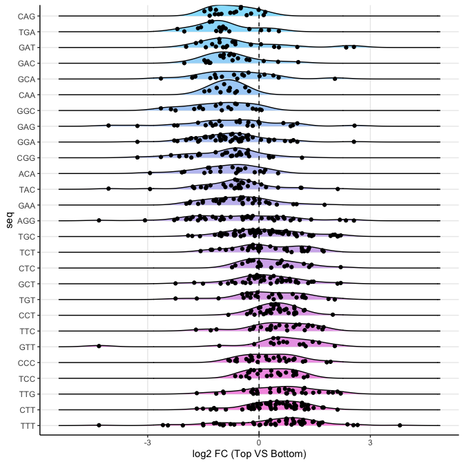

``` r
ggsave("./Figs/Ridgeplots_trimers_HEK.pdf", height = 6, width = 4, scale = 1.2)


wilcox.seqs %>% 
  pull(seq) %>% 
  unique() %>% 
  length() -> n.seq

col.pal <- colorRampPalette(c("#fd97e1", "#97e1fd"))(100)[seq(1, 100, length.out = n.seq)]

wilcox.seqs %>% 
  mutate(seq = reorder(seq, -log2topVSbot, FUN = get_top)) %>% 
ggplot(aes(x = log2topVSbot, y = seq, fill = seq))+
  geom_density_ridges(panel_scaling = T, jittered_points = TRUE,  scale = 0.95)+
  scale_fill_manual(values = col.pal)+
  theme_classic()+
  theme(panel.grid.major = element_line(), legend.position = "none")+
  geom_vline(xintercept = 0, linetype = "dashed", color = "black")+
  labs(x = "log2 FC (Top VS Bottom)")
```

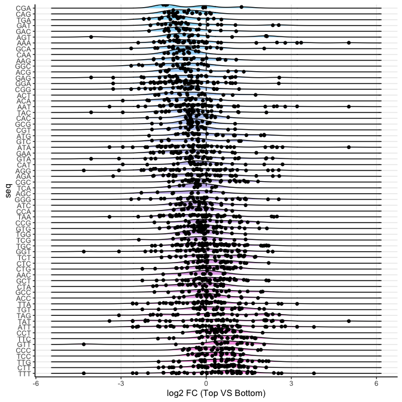

``` r
ggsave("./Figs/Ridgeplots_trimers_HEK_all.pdf", height = 12, width = 4, scale = 1.2)
```

Colored by nucleotide count

``` r
wilcox.seqs %>% 
  dplyr::filter(p < 0.05) %>% 
  mutate(seq = reorder(seq, -log2topVSbot, FUN = get_top),
         n.nucleotides = as.factor(str_count(seq, "A|G"))) %>% 
ggplot(aes(x = log2topVSbot, y = seq, fill = n.nucleotides))+
  geom_density_ridges(panel_scaling = T, jittered_points = TRUE,  scale = 0.95)+
  scale_fill_manual(values = c("#e9e9ff","#b3b4fe","#7779ff","#3a3cfc"))+
  theme_classic()+
  theme(panel.grid.major = element_line(), legend.position = "bottom")+
  geom_vline(xintercept = 0, linetype = "dashed", color = "black")+
  labs(x = "log2 FC (Top VS Bottom)")
```

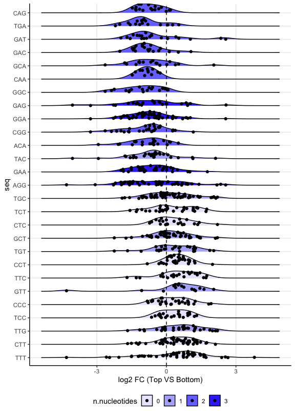

``` r
ggsave("./Figs/Ridgeplots_trimers_AG_HEK.pdf", height = 6, width = 4, scale = 1.2)

wilcox.seqs %>% 
  mutate(seq = reorder(seq, -log2topVSbot, FUN = get_top),
         n.nucleotides = as.factor(str_count(seq, "A|G"))) %>% 
ggplot(aes(x = log2topVSbot, y = seq, fill = n.nucleotides))+
  geom_density_ridges(panel_scaling = T, jittered_points = TRUE,  scale = 0.95)+
  scale_fill_manual(values = c("#e9e9ff","#b3b4fe","#7779ff","#3a3cfc"))+
  theme_classic()+
  theme(panel.grid.major = element_line(), legend.position = "bottom")+
  geom_vline(xintercept = 0, linetype = "dashed", color = "black")+
  labs(x = "log2 FC (Top VS Bottom)")
```

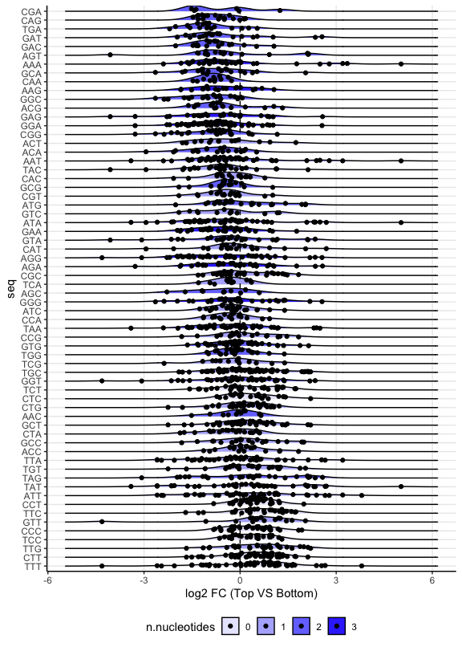

``` r
ggsave("./Figs/Ridgeplots_trimers_AG_HEK_all.pdf", height = 12, width = 4, scale = 1.2)
```

``` r
wilcox.seqs %>% 
  dplyr::filter(p < 0.05) %>% 
  mutate(seq = reorder(seq, -log2topVSbot, FUN = get_top),
         n.nucleotides = as.factor(str_count(seq, "C|T"))) %>% 
ggplot(aes(x = log2topVSbot, y = seq, fill = n.nucleotides))+
  geom_density_ridges(panel_scaling = T, jittered_points = TRUE,  scale = 0.95)+
  scale_fill_manual(values = c("#fdf0f0","#ffc9c9","#ff8383","#fc3a3a"))+
  theme_classic()+
  theme(panel.grid.major = element_line(), legend.position = "bottom")+
  geom_vline(xintercept = 0, linetype = "dashed", color = "black")+
  labs(x = "log2 FC (Top VS Bottom)")
```

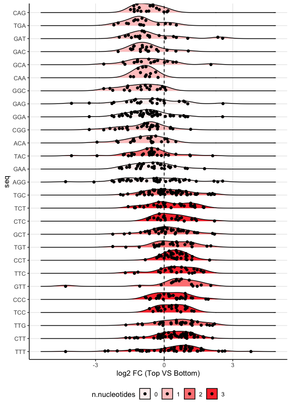

``` r
ggsave("./Figs/Ridgeplots_trimers_CT_HEK.pdf", height = 6, width = 4, scale = 1.2)

wilcox.seqs %>% 
  mutate(seq = reorder(seq, -log2topVSbot, FUN = get_top),
         n.nucleotides = as.factor(str_count(seq, "C|T"))) %>% 
ggplot(aes(x = log2topVSbot, y = seq, fill = n.nucleotides))+
  geom_density_ridges(panel_scaling = T, jittered_points = TRUE,  scale = 0.95)+
  scale_fill_manual(values = c("#fdf0f0","#ffc9c9","#ff8383","#fc3a3a"))+
  theme_classic()+
  theme(panel.grid.major = element_line(), legend.position = "bottom")+
  geom_vline(xintercept = 0, linetype = "dashed", color = "black")+
  labs(x = "log2 FC (Top VS Bottom)")
```

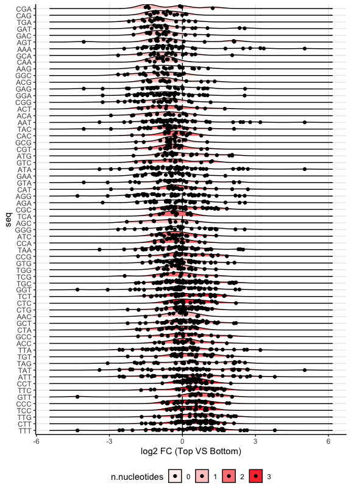

``` r
ggsave("./Figs/Ridgeplots_trimers_CT_HEK_all.pdf", height = 12, width = 4, scale = 1.2)
```

## Test for dimers

Get all possible dimers

``` r
x <- expand.grid(rep(list(c('A', 'G', 'T', 'C')), 2))
x <- do.call(paste0, x)

x 
```

    ##  [1] "AA" "GA" "TA" "CA" "AG" "GG" "TG" "CG" "AT" "GT" "TT" "CT" "AC" "GC" "TC"
    ## [16] "CC"

Run get_stats function for all motifs.

``` r
wilcox.seqs <- map_dfr(x, get_stats)

wilcox.seqs
```

    ## # A tibble: 1,892 × 9
    ##    .y.          group1 group2    n1    n2 statistic      p seq   log2topVSbot
    ##    <chr>        <chr>  <chr>  <int> <int>     <dbl>  <dbl> <chr>        <dbl>
    ##  1 log2topVSbot no     yes      354   113     23550 0.0045 AA          -1.59 
    ##  2 log2topVSbot no     yes      354   113     23550 0.0045 AA           0.525
    ##  3 log2topVSbot no     yes      354   113     23550 0.0045 AA          -1.65 
    ##  4 log2topVSbot no     yes      354   113     23550 0.0045 AA          -1.05 
    ##  5 log2topVSbot no     yes      354   113     23550 0.0045 AA          -1.00 
    ##  6 log2topVSbot no     yes      354   113     23550 0.0045 AA          -0.667
    ##  7 log2topVSbot no     yes      354   113     23550 0.0045 AA          -0.141
    ##  8 log2topVSbot no     yes      354   113     23550 0.0045 AA           0.925
    ##  9 log2topVSbot no     yes      354   113     23550 0.0045 AA          -1.14 
    ## 10 log2topVSbot no     yes      354   113     23550 0.0045 AA          -0.265
    ## # ℹ 1,882 more rows

``` r
write_tsv(wilcox.seqs, "Output/wilcox_results_dimers_HEK.tsv")
```

### Visualize

``` r
wilcox.seqs %>% 
  dplyr::filter(p < 0.05) %>% 
  pull(seq) %>% 
  unique() %>% 
  length() -> n.seq

col.pal <- colorRampPalette(c("#fd97e1", "#97e1fd"))(100)[seq(1, 100, length.out = n.seq)]

wilcox.seqs %>% 
  dplyr::filter(p < 0.05) %>% 
  mutate(seq = reorder(seq, -log2topVSbot, FUN = get_top)) %>% 
ggplot(aes(x = log2topVSbot, y = seq, fill = seq))+
  geom_density_ridges(panel_scaling = T, jittered_points = TRUE,  scale = 0.95)+
  scale_fill_manual(values = col.pal)+
  theme_classic()+
  theme(panel.grid.major = element_line(), legend.position = "none")+
  geom_vline(xintercept = 0, linetype = "dashed", color = "black")+
  labs(x = "log2 FC (Top VS Bottom)")
```

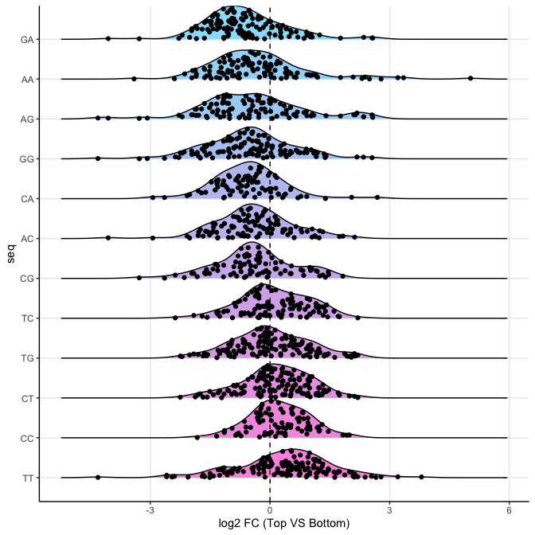

``` r
ggsave("./Figs/Ridgeplots_dimers_HEK.pdf", height = 6, width = 4, scale = 1.2)


wilcox.seqs %>% 
  pull(seq) %>% 
  unique() %>% 
  length() -> n.seq

col.pal <- colorRampPalette(c("#fd97e1", "#97e1fd"))(100)[seq(1, 100, length.out = n.seq)]

wilcox.seqs %>% 
  mutate(seq = reorder(seq, -log2topVSbot, FUN = get_top)) %>% 
ggplot(aes(x = log2topVSbot, y = seq, fill = seq))+
  geom_density_ridges(panel_scaling = T, jittered_points = TRUE,  scale = 0.95)+
  scale_fill_manual(values = col.pal)+
  theme_classic()+
  theme(panel.grid.major = element_line(), legend.position = "none")+
  geom_vline(xintercept = 0, linetype = "dashed", color = "black")+
  labs(x = "log2 FC (Top VS Bottom)")
```


``` r
ggsave("./Figs/Ridgeplots_dimers_HEK_all.pdf", height = 8, width = 4, scale = 1.2)
```

``` r
wilcox.seqs %>% 
  dplyr::filter(p < 0.05) %>% 
  mutate(seq = reorder(seq, -log2topVSbot, FUN = get_top),
         n.nucleotides = as.factor(str_count(seq, "A|G"))) %>% 
ggplot(aes(x = log2topVSbot, y = seq, fill = n.nucleotides))+
  geom_density_ridges(panel_scaling = T, jittered_points = TRUE,  scale = 0.95)+
  scale_fill_manual(values = c("#ddddff","#9092ff","#3a3cfc"))+
  theme_classic()+
  theme(panel.grid.major = element_line(), legend.position = "bottom")+
  geom_vline(xintercept = 0, linetype = "dashed", color = "black")+
  labs(x = "log2 FC (Top VS Bottom)")
```

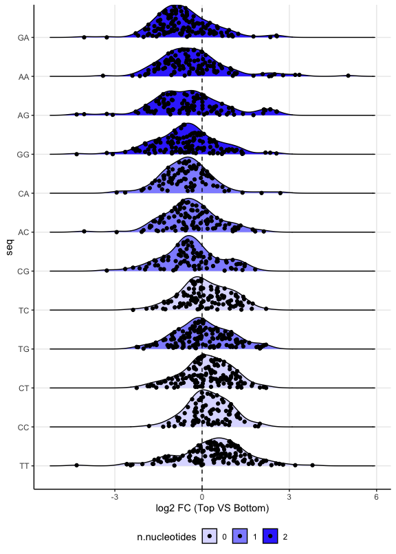

``` r
ggsave("./Figs/Ridgeplots_dimers_AG_HEK.pdf", height = 6, width = 4, scale = 1.2)

wilcox.seqs %>% 
  mutate(seq = reorder(seq, -log2topVSbot, FUN = get_top),
         n.nucleotides = as.factor(str_count(seq, "A|G"))) %>% 
ggplot(aes(x = log2topVSbot, y = seq, fill = n.nucleotides))+
  geom_density_ridges(panel_scaling = T, jittered_points = TRUE,  scale = 0.95)+
  scale_fill_manual(values = c("#ddddff","#9092ff","#3a3cfc"))+
  theme_classic()+
  theme(panel.grid.major = element_line(), legend.position = "bottom")+
  geom_vline(xintercept = 0, linetype = "dashed", color = "black")+
  labs(x = "log2 FC (Top VS Bottom)")
```

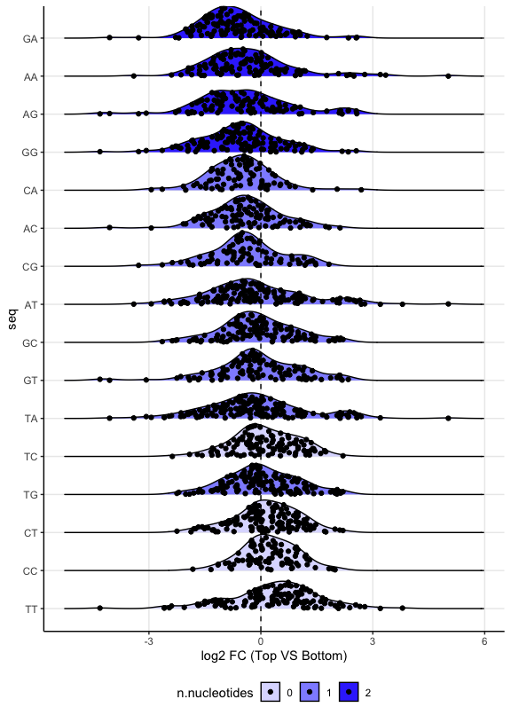

``` r
ggsave("./Figs/Ridgeplots_dimers_AG_HEK_all.pdf", height = 8, width = 4, scale = 1.2)
```

``` r
wilcox.seqs %>% 
  dplyr::filter(p < 0.05) %>% 
  mutate(seq = reorder(seq, -log2topVSbot, FUN = get_top),
         n.nucleotides = as.factor(str_count(seq, "C|T"))) %>% 
ggplot(aes(x = log2topVSbot, y = seq, fill = n.nucleotides))+
  geom_density_ridges(panel_scaling = T, jittered_points = TRUE,  scale = 0.95)+
  scale_fill_manual(values = c("#ffd8d8","#ff8383","#fc3a3a"))+
  theme_classic()+
  theme(panel.grid.major = element_line(), legend.position = "bottom")+
  geom_vline(xintercept = 0, linetype = "dashed", color = "black")+
  labs(x = "log2 FC (Top VS Bottom)")
```

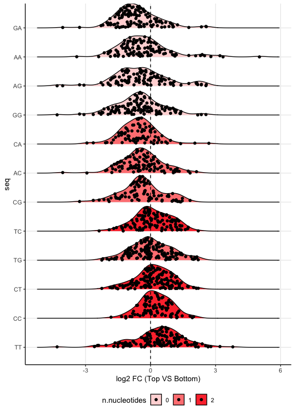

``` r
ggsave("./Figs/Ridgeplots_dimers_CT_HEK.pdf", height = 6, width = 4, scale = 1.2)

wilcox.seqs %>% 
  mutate(seq = reorder(seq, -log2topVSbot, FUN = get_top),
         n.nucleotides = as.factor(str_count(seq, "C|T"))) %>% 
ggplot(aes(x = log2topVSbot, y = seq, fill = n.nucleotides))+
  geom_density_ridges(panel_scaling = T, jittered_points = TRUE,  scale = 0.95)+
  scale_fill_manual(values = c("#ffd8d8","#ff8383","#fc3a3a"))+
  theme_classic()+
  theme(panel.grid.major = element_line(), legend.position = "bottom")+
  geom_vline(xintercept = 0, linetype = "dashed", color = "black")+
  labs(x = "log2 FC (Top VS Bottom)")
```


``` r
ggsave("./Figs/Ridgeplots_dimers_CT_HEK_all.pdf", height = 8, width = 4, scale = 1.2)
```

## Content analysis

Check occurrence of CT’s or TC’s and AG’s or GA’s within the motif

``` r
aligned %>% 
  mutate(CT = as.factor(str_count(Motif, "CT|TC"))) %>% 
  mutate(log2topVSbot = log2(avg.top/avg.bot)) %>% 
ggplot(aes(x = CT, y = log2topVSbot, fill = CT))+
  geom_violin()+
  geom_jitter(width = 0.2)+
  scale_fill_manual(values = c("#fdf0f0","#ffc9c9","#ff8383","#fc3a3a"))+
  stat_compare_means(ref.group = "0")+
  theme_classic()+
  theme(panel.grid.major.y = element_line(),legend.position="none", plot.title = element_text(hjust = 0.5))
```

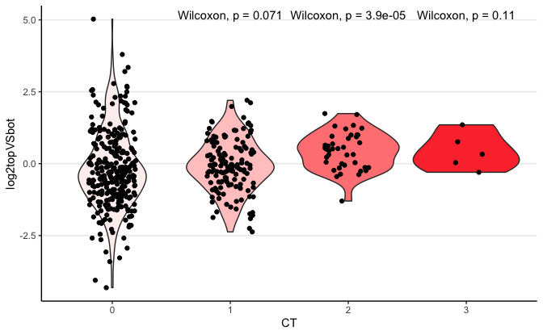

``` r
ggsave("./Figs/Violin_content_CT_TC_HEK.pdf", height = 4, width = 6, scale = 1.2)


aligned %>% 
  mutate(AG = as.factor(str_count(Motif, "AG|GA"))) %>% 
  mutate(log2topVSbot = log2(avg.top/avg.bot)) %>% 
ggplot(aes(x = as_factor(AG), y = log2topVSbot, fill = AG))+
  geom_violin()+
  geom_jitter(width = 0.2)+
  scale_fill_manual(values = c("#e9e9ff","#b3b4fe","#7779ff","#3a3cfc"))+
  stat_compare_means(ref.group = "0")+
  theme_classic()+
  theme(panel.grid.major.y = element_line(),legend.position="none", plot.title = element_text(hjust = 0.5))
```

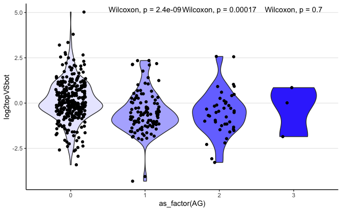

``` r
ggsave("./Figs/Violin_content_AG_GA_HEK.pdf", height = 4, width = 6, scale = 1.2)
```

Check occurrence of C’s or T’s and A’s or G’s within the motif

``` r
col.pal <- colorRampPalette(c("#fdf0f0", "#fc3a3a"))(100)[seq(1, 100, length.out = 8)]

aligned %>% 
  separate(Motif, into = c("oligo", "nr", "Motif")) %>% 
  mutate(CT = as.factor(str_count(Motif, "C|T"))) %>% 
  mutate(log2topVSbot = log2(avg.top/avg.bot)) %>% 
ggplot(aes(x = CT, y = log2topVSbot, fill = CT))+
  geom_violin(scale = "width")+
  geom_jitter(width = 0.2)+
  scale_fill_manual(values = col.pal)+
  stat_compare_means(ref.group = "0")+
  theme_classic()+
  theme(panel.grid.major.y = element_line(),legend.position="none", plot.title = element_text(hjust = 0.5))
```

    ## Warning: Groups with fewer than two data points have been dropped.

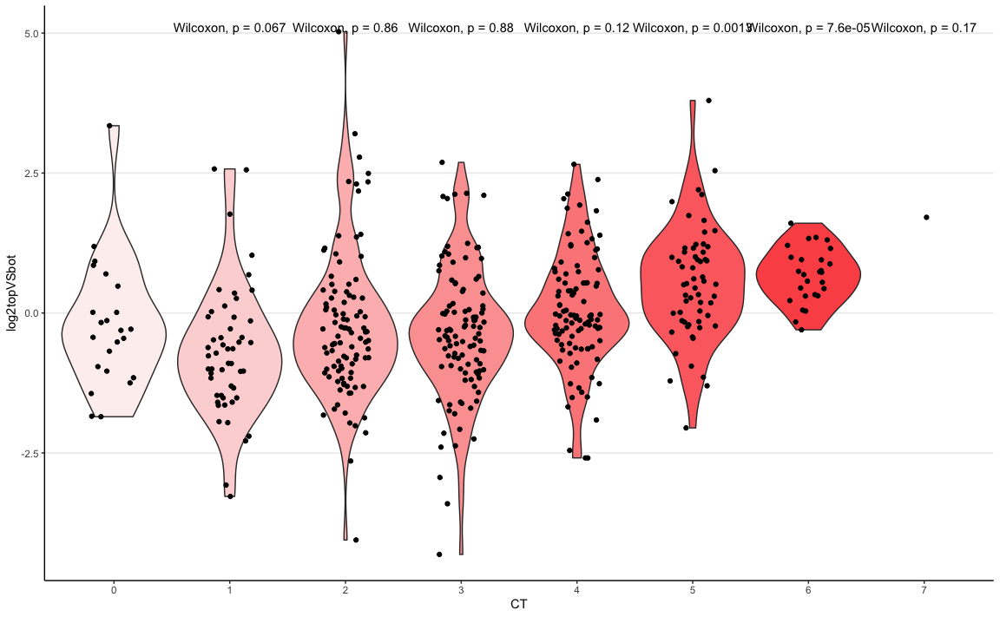

``` r
ggsave("./Figs/Violin_content_C_T_HEK.pdf", height = 4, width = 10, scale = 1.2)
```

    ## Warning: Groups with fewer than two data points have been dropped.

``` r
col.pal <- colorRampPalette(c("#e9e9ff", "#3a3cfc"))(100)[seq(1, 100, length.out = 7)]

aligned %>% 
  separate(Motif, into = c("oligo", "nr", "Motif")) %>% 
  mutate(AG = as.factor(str_count(Motif, "A|G"))) %>% 
  mutate(log2topVSbot = log2(avg.top/avg.bot)) %>% 
ggplot(aes(x = as_factor(AG), y = log2topVSbot, fill = AG))+
  geom_violin(scale = "width")+
  geom_jitter(width = 0.2)+
  scale_fill_manual(values = col.pal)+
  stat_compare_means(ref.group = "0")+
  theme_classic()+
  theme(panel.grid.major.y = element_line(),legend.position="none", plot.title = element_text(hjust = 0.5))
```

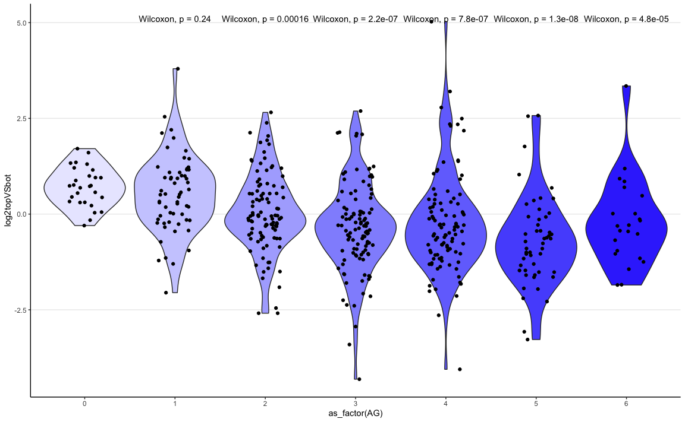

``` r
ggsave("./Figs/Violin_content_A_G_HEK.pdf", height = 4, width = 10, scale = 1.2)
```

# HeLa

``` r
aligned <- read_tsv("./Output/RE_013_HeLa_normalized.tsv")

aligned
```

    ## # A tibble: 459 × 13
    ##    Motif HeLa.LoMi.A HeLa.LoMi.B HeLa.LoLo.A HeLa.LoLo.B HeLa.HiMi.A HeLa.HiMi.B
    ##    <chr>       <dbl>       <dbl>       <dbl>       <dbl>       <dbl>       <dbl>
    ##  1 olig…      0.0539        3.75       0.216      0.0554      3.15         3.46 
    ##  2 olig…      0.324         7.50      20.8       12.8         0.0828       4.30 
    ##  3 olig…      0.108         3.75       4.97       8.92        1.24         1.52 
    ##  4 olig…      8.58          3.75       0.216      2.16        0.0828       3.39 
    ##  5 olig…     44.2          37.5       68.8       61.6        85.4        101.   
    ##  6 olig…      0.0539        3.75       0.216      0.0554      4.39         0.970
    ##  7 olig…      0.162         3.75      13.6       13.5         3.56         5.06 
    ##  8 olig…     22.4          22.5       26.6       28.4        25.9         23.1  
    ##  9 olig…     69.0          63.8       83.9       66.1        86.6         62.1  
    ## 10 olig…    127.            3.75      36.1       35.1        33.0         26.9  
    ## # ℹ 449 more rows
    ## # ℹ 6 more variables: HeLa.HiHi.A <dbl>, HeLa.HiHi.B <dbl>, LoMi <dbl>,
    ## #   LoLo <dbl>, HiMi <dbl>, HiHi <dbl>

## Test for enriched trimers

Get all possible trimers

``` r
x <- expand.grid(rep(list(c('A', 'G', 'T', 'C')), 3))
x <- do.call(paste0, x)

x 
```

    ##  [1] "AAA" "GAA" "TAA" "CAA" "AGA" "GGA" "TGA" "CGA" "ATA" "GTA" "TTA" "CTA"
    ## [13] "ACA" "GCA" "TCA" "CCA" "AAG" "GAG" "TAG" "CAG" "AGG" "GGG" "TGG" "CGG"
    ## [25] "ATG" "GTG" "TTG" "CTG" "ACG" "GCG" "TCG" "CCG" "AAT" "GAT" "TAT" "CAT"
    ## [37] "AGT" "GGT" "TGT" "CGT" "ATT" "GTT" "TTT" "CTT" "ACT" "GCT" "TCT" "CCT"
    ## [49] "AAC" "GAC" "TAC" "CAC" "AGC" "GGC" "TGC" "CGC" "ATC" "GTC" "TTC" "CTC"
    ## [61] "ACC" "GCC" "TCC" "CCC"

Define function that tests for motifs that are significantly enriched or
depleted, and extracts their log2 fold changes.

``` r
get_stats <- function(seq){
  
  aligned %>% 
    mutate(log2topVSbot = log2(HiHi/LoLo)) %>% 
    filter(str_detect(Motif, seq) ) %>% 
    mutate(seq = seq) %>% 
    select(log2topVSbot, seq) -> tmp
    
  aligned %>% 
    mutate(log2topVSbot = log2(HiHi/LoLo)) %>% 
      mutate(contains.seq = as.factor(case_when(str_detect(Motif, seq) ~ "yes", TRUE ~ "no"))) %>% 
    wilcox_test(log2topVSbot~contains.seq) %>% 
    mutate(seq = seq) %>% 
    inner_join(tmp)
}
```

Run function for all motifs.

``` r
wilcox.seqs <- map_dfr(x, get_stats)

wilcox.seqs
```

    ## # A tibble: 1,733 × 9
    ##    .y.          group1 group2    n1    n2 statistic     p seq   log2topVSbot
    ##    <chr>        <chr>  <chr>  <int> <int>     <dbl> <dbl> <chr>        <dbl>
    ##  1 log2topVSbot no     yes      424    35     6480. 0.213 AAA          5.23 
    ##  2 log2topVSbot no     yes      424    35     6480. 0.213 AAA         -7.81 
    ##  3 log2topVSbot no     yes      424    35     6480. 0.213 AAA         -0.129
    ##  4 log2topVSbot no     yes      424    35     6480. 0.213 AAA         -4.07 
    ##  5 log2topVSbot no     yes      424    35     6480. 0.213 AAA          2.63 
    ##  6 log2topVSbot no     yes      424    35     6480. 0.213 AAA         -7.44 
    ##  7 log2topVSbot no     yes      424    35     6480. 0.213 AAA          2.50 
    ##  8 log2topVSbot no     yes      424    35     6480. 0.213 AAA          3.19 
    ##  9 log2topVSbot no     yes      424    35     6480. 0.213 AAA          1.30 
    ## 10 log2topVSbot no     yes      424    35     6480. 0.213 AAA          6.89 
    ## # ℹ 1,723 more rows

``` r
write_tsv(wilcox.seqs, "Output/wilcox_results_trimers_HeLa.tsv")
```

### Visualize

``` r
wilcox.seqs %>% 
  dplyr::filter(p < 0.05) %>% 
  pull(seq) %>% 
  unique() %>% 
  length() -> n.seq

col.pal <- colorRampPalette(c("#fd97e1", "#97e1fd"))(100)[seq(1, 100, length.out = n.seq)]

wilcox.seqs %>% 
  dplyr::filter(p < 0.05) %>% 
  mutate(seq = reorder(seq, -log2topVSbot, FUN = get_top)) %>% 
ggplot(aes(x = log2topVSbot, y = seq, fill = seq))+
  geom_density_ridges(panel_scaling = T, jittered_points = TRUE,  scale = 0.95)+
  scale_fill_manual(values = col.pal)+
  theme_classic()+
  theme(panel.grid.major = element_line(), legend.position = "none")+
  geom_vline(xintercept = 0, linetype = "dashed", color = "black")+
  labs(x = "log2 FC (Top VS Bottom)")
```

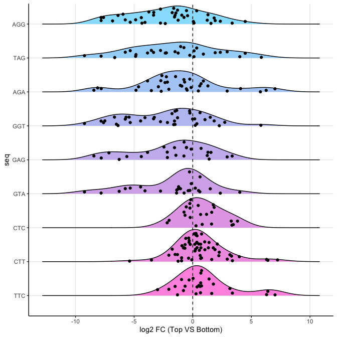

``` r
ggsave("./Figs/Ridgeplots_trimers_HeLa.pdf", height = 6, width = 4, scale = 1.2)


wilcox.seqs %>% 
  pull(seq) %>% 
  unique() %>% 
  length() -> n.seq

col.pal <- colorRampPalette(c("#fd97e1", "#97e1fd"))(100)[seq(1, 100, length.out = n.seq)]

wilcox.seqs %>% 
  mutate(seq = reorder(seq, -log2topVSbot, FUN = get_top)) %>% 
ggplot(aes(x = log2topVSbot, y = seq, fill = seq))+
  geom_density_ridges(panel_scaling = T, jittered_points = TRUE,  scale = 0.95)+
  scale_fill_manual(values = col.pal)+
  theme_classic()+
  theme(panel.grid.major = element_line(), legend.position = "none")+
  geom_vline(xintercept = 0, linetype = "dashed", color = "black")+
  labs(x = "log2 FC (Top VS Bottom)")
```

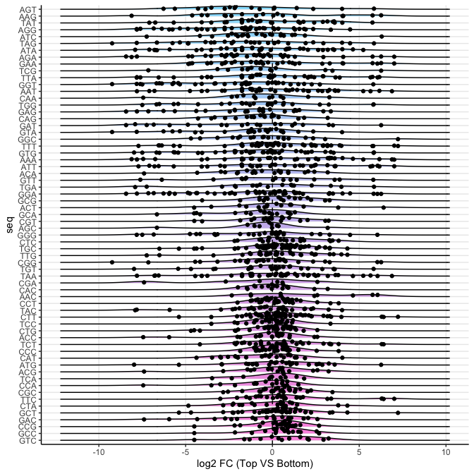

``` r
ggsave("./Figs/Ridgeplots_trimers_HeLa_all.pdf", height = 12, width = 4, scale = 1.2)
```

Nucleotide content highlighted

``` r
wilcox.seqs %>% 
  dplyr::filter(p < 0.05) %>% 
  mutate(seq = reorder(seq, -log2topVSbot, FUN = get_top),
         n.nucleotides = factor(str_count(seq, "A|G"), levels = 0:3)) %>% 
ggplot(aes(x = log2topVSbot, y = seq, fill = n.nucleotides))+
  geom_density_ridges(panel_scaling = T, jittered_points = TRUE,  scale = 0.95)+
  scale_fill_manual(values = c("#e9e9ff","#b3b4fe","#7779ff","#3a3cfc"), drop = F)+
  theme_classic()+
  theme(panel.grid.major = element_line(), legend.position = "bottom")+
  geom_vline(xintercept = 0, linetype = "dashed", color = "black")+
  labs(x = "log2 FC (Top VS Bottom)")
```

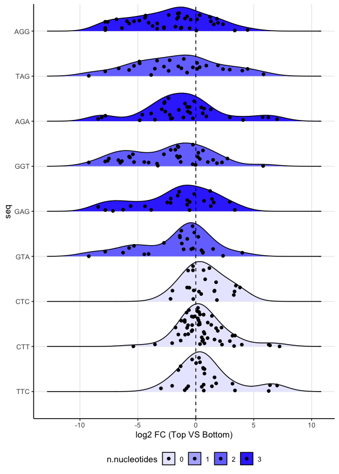

``` r
ggsave("./Figs/Ridgeplots_trimers_AG_HeLa.pdf", height = 6, width = 4, scale = 1.2)

wilcox.seqs %>% 
  mutate(seq = reorder(seq, -log2topVSbot, FUN = get_top),
         n.nucleotides = factor(str_count(seq, "A|G"), levels = 0:3)) %>% 
ggplot(aes(x = log2topVSbot, y = seq, fill = n.nucleotides))+
  geom_density_ridges(panel_scaling = T, jittered_points = TRUE,  scale = 0.95)+
  scale_fill_manual(values = c("#e9e9ff","#b3b4fe","#7779ff","#3a3cfc"), drop = F)+
  theme_classic()+
  theme(panel.grid.major = element_line(), legend.position = "bottom")+
  geom_vline(xintercept = 0, linetype = "dashed", color = "black")+
  labs(x = "log2 FC (Top VS Bottom)")
```

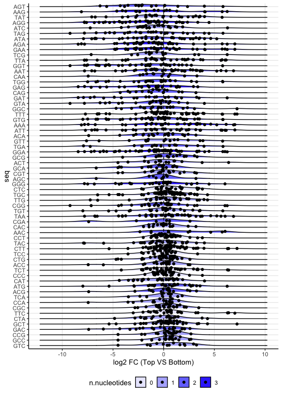

``` r
ggsave("./Figs/Ridgeplots_trimers_AG_HeLa_all.pdf", height = 12, width = 4, scale = 1.2)
```

``` r
wilcox.seqs %>% 
  dplyr::filter(p < 0.05) %>% 
  mutate(seq = reorder(seq, -log2topVSbot, FUN = get_top),
         n.nucleotides = factor(str_count(seq, "C|T"), levels = 0:3)) %>% 
ggplot(aes(x = log2topVSbot, y = seq, fill = n.nucleotides))+
  geom_density_ridges(panel_scaling = T, jittered_points = TRUE,  scale = 0.95)+
  scale_fill_manual(values = c("#fdf0f0","#ffc9c9","#ff8383","#fc3a3a"), drop = F)+
  theme_classic()+
  theme(panel.grid.major = element_line(), legend.position = "bottom")+
  geom_vline(xintercept = 0, linetype = "dashed", color = "black")+
  labs(x = "log2 FC (Top VS Bottom)")
```

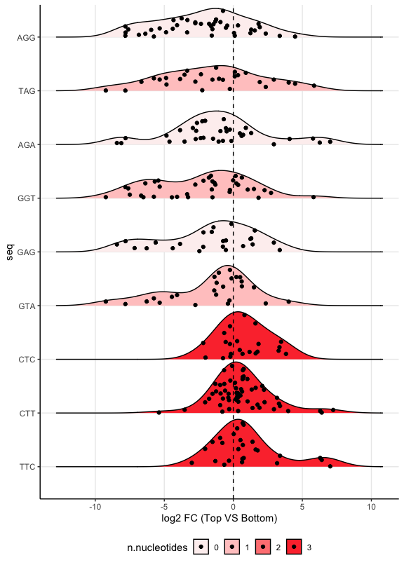

``` r
ggsave("./Figs/Ridgeplots_trimers_CT_HeLa.pdf", height = 6, width = 4, scale = 1.2)

wilcox.seqs %>% 
  mutate(seq = reorder(seq, -log2topVSbot, FUN = get_top),
         n.nucleotides = as.factor(str_count(seq, "C|T"))) %>% 
ggplot(aes(x = log2topVSbot, y = seq, fill = n.nucleotides))+
  geom_density_ridges(panel_scaling = T, jittered_points = TRUE,  scale = 0.95)+
  scale_fill_manual(values = c("#fdf0f0","#ffc9c9","#ff8383","#fc3a3a"), drop = F)+
  theme_classic()+
  theme(panel.grid.major = element_line(), legend.position = "bottom")+
  geom_vline(xintercept = 0, linetype = "dashed", color = "black")+
  labs(x = "log2 FC (Top VS Bottom)")
```

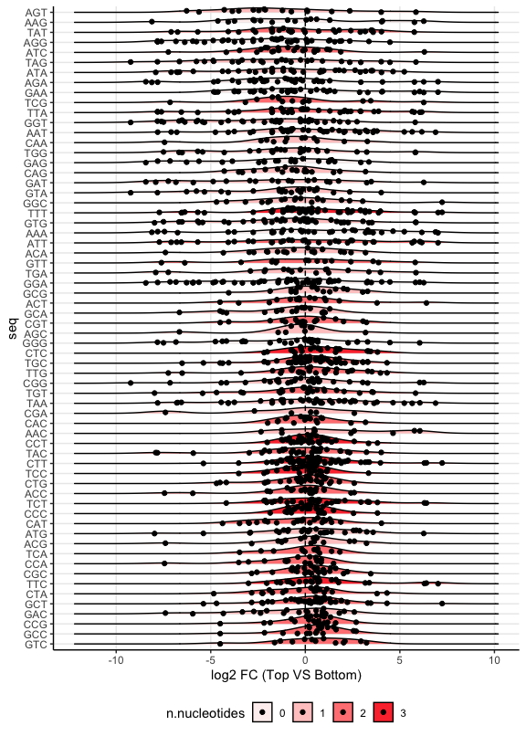

``` r
ggsave("./Figs/Ridgeplots_trimers_CT_HeLa_all.pdf", height = 12, width = 4, scale = 1.2)
```

## Test for dimers

Get all possible dimers

``` r
x <- expand.grid(rep(list(c('A', 'G', 'T', 'C')), 2))
x <- do.call(paste0, x)

x 
```

    ##  [1] "AA" "GA" "TA" "CA" "AG" "GG" "TG" "CG" "AT" "GT" "TT" "CT" "AC" "GC" "TC"
    ## [16] "CC"

Run get_stats function for all motifs.

``` r
wilcox.seqs <- map_dfr(x, get_stats)

wilcox.seqs
```

    ## # A tibble: 1,865 × 9
    ##    .y.          group1 group2    n1    n2 statistic     p seq   log2topVSbot
    ##    <chr>        <chr>  <chr>  <int> <int>     <dbl> <dbl> <chr>        <dbl>
    ##  1 log2topVSbot no     yes      352   107     18472 0.765 AA           5.23 
    ##  2 log2topVSbot no     yes      352   107     18472 0.765 AA          -7.81 
    ##  3 log2topVSbot no     yes      352   107     18472 0.765 AA          -0.129
    ##  4 log2topVSbot no     yes      352   107     18472 0.765 AA          -4.07 
    ##  5 log2topVSbot no     yes      352   107     18472 0.765 AA          -0.119
    ##  6 log2topVSbot no     yes      352   107     18472 0.765 AA           2.63 
    ##  7 log2topVSbot no     yes      352   107     18472 0.765 AA          -0.747
    ##  8 log2topVSbot no     yes      352   107     18472 0.765 AA          -7.44 
    ##  9 log2topVSbot no     yes      352   107     18472 0.765 AA           0.771
    ## 10 log2topVSbot no     yes      352   107     18472 0.765 AA           2.50 
    ## # ℹ 1,855 more rows

``` r
write_tsv(wilcox.seqs, "Output/wilcox_results_dimers_HeLa.tsv")
```

### Visualize

``` r
wilcox.seqs %>% 
  dplyr::filter(p < 0.05) %>% 
  pull(seq) %>% 
  unique() %>% 
  length() -> n.seq

col.pal <- colorRampPalette(c("#fd97e1", "#97e1fd"))(100)[seq(1, 100, length.out = n.seq)]

wilcox.seqs %>% 
  dplyr::filter(p < 0.05) %>% 
  mutate(seq = reorder(seq, -log2topVSbot, FUN = get_top)) %>% 
ggplot(aes(x = log2topVSbot, y = seq, fill = seq))+
  geom_density_ridges(panel_scaling = T, jittered_points = TRUE,  scale = 0.95)+
  scale_fill_manual(values = col.pal)+
  theme_classic()+
  theme(panel.grid.major = element_line(), legend.position = "none")+
  geom_vline(xintercept = 0, linetype = "dashed", color = "black")+
  labs(x = "log2 FC (Top VS Bottom)")
```

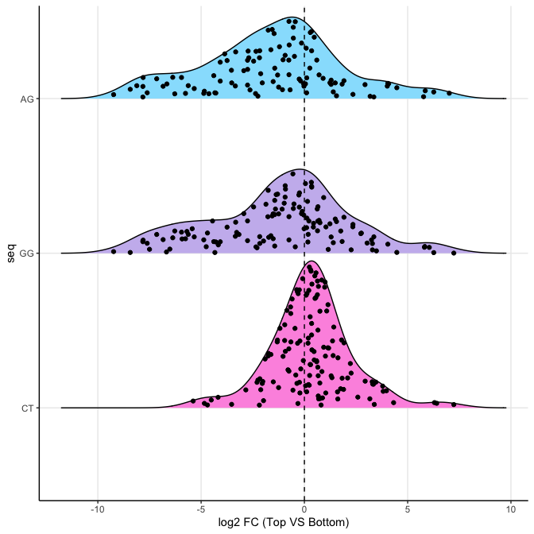

``` r
ggsave("./Figs/Ridgeplots_dimers_HeLa.pdf", height = 6, width = 4, scale = 1.2)


wilcox.seqs %>% 
  pull(seq) %>% 
  unique() %>% 
  length() -> n.seq

col.pal <- colorRampPalette(c("#fd97e1", "#97e1fd"))(100)[seq(1, 100, length.out = n.seq)]

wilcox.seqs %>% 
  mutate(seq = reorder(seq, -log2topVSbot, FUN = get_top)) %>% 
ggplot(aes(x = log2topVSbot, y = seq, fill = seq))+
  geom_density_ridges(panel_scaling = T, jittered_points = TRUE,  scale = 0.95)+
  scale_fill_manual(values = col.pal)+
  theme_classic()+
  theme(panel.grid.major = element_line(), legend.position = "none")+
  geom_vline(xintercept = 0, linetype = "dashed", color = "black")+
  labs(x = "log2 FC (Top VS Bottom)")
```

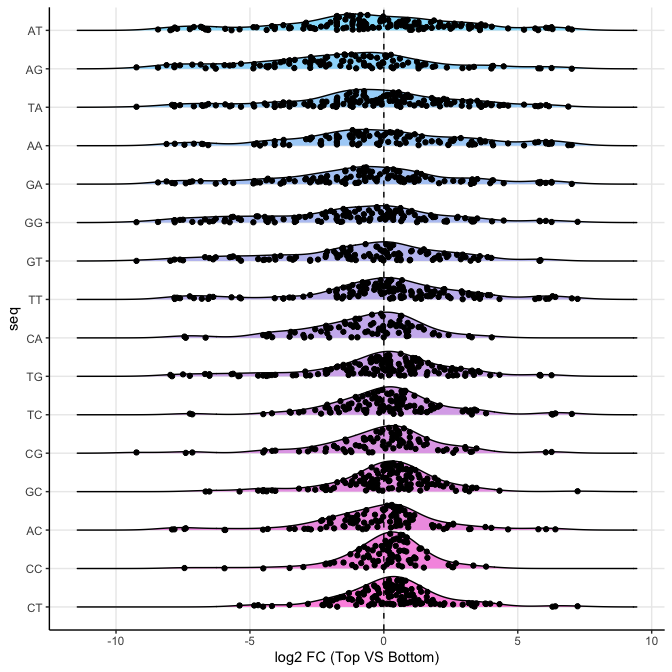

``` r
ggsave("./Figs/Ridgeplots_dimers_HeLa_all.pdf", height = 8, width = 4, scale = 1.2)
```

``` r
wilcox.seqs %>% 
  dplyr::filter(p < 0.05) %>% 
  mutate(seq = reorder(seq, -log2topVSbot, FUN = get_top),
         n.nucleotides = as.factor(str_count(seq, "A|G"))) %>% 
ggplot(aes(x = log2topVSbot, y = seq, fill = n.nucleotides))+
  geom_density_ridges(panel_scaling = T, jittered_points = TRUE,  scale = 0.95)+
  scale_fill_manual(values = c("#ddddff","#9092ff","#3a3cfc"))+
  theme_classic()+
  theme(panel.grid.major = element_line(), legend.position = "bottom")+
  geom_vline(xintercept = 0, linetype = "dashed", color = "black")+
  labs(x = "log2 FC (Top VS Bottom)")
```

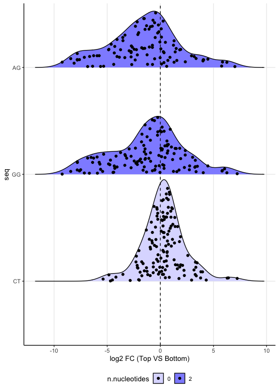

``` r
ggsave("./Figs/Ridgeplots_dimers_AG_HeLa.pdf", height = 4, width = 4, scale = 1.2)

wilcox.seqs %>% 
  mutate(seq = reorder(seq, -log2topVSbot, FUN = get_top),
         n.nucleotides = as.factor(str_count(seq, "A|G"))) %>% 
ggplot(aes(x = log2topVSbot, y = seq, fill = n.nucleotides))+
  geom_density_ridges(panel_scaling = T, jittered_points = TRUE,  scale = 0.95)+
  scale_fill_manual(values = c("#ddddff","#9092ff","#3a3cfc"))+
  theme_classic()+
  theme(panel.grid.major = element_line(), legend.position = "bottom")+
  geom_vline(xintercept = 0, linetype = "dashed", color = "black")+
  labs(x = "log2 FC (Top VS Bottom)")
```

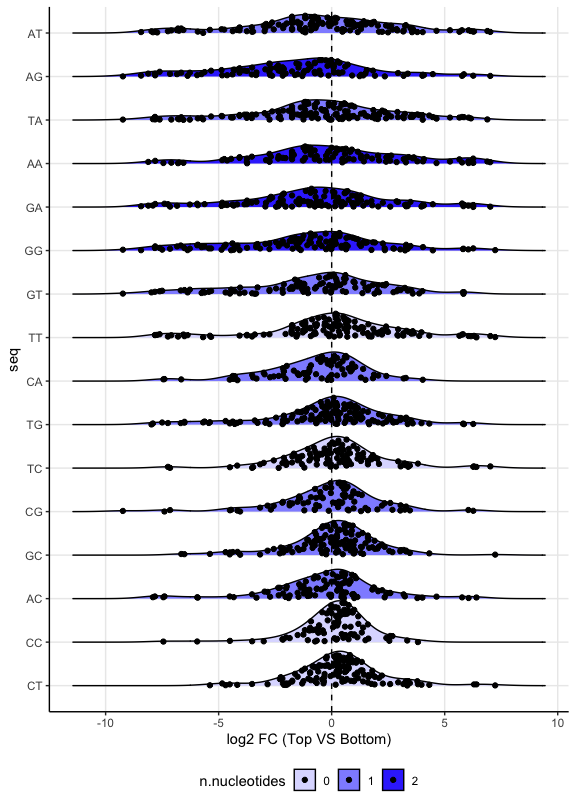

``` r
ggsave("./Figs/Ridgeplots_dimers_AG_HeLa_all.pdf", height = 8, width = 4, scale = 1.2)
```

``` r
wilcox.seqs %>% 
  dplyr::filter(p < 0.05) %>% 
  mutate(seq = reorder(seq, -log2topVSbot, FUN = get_top),
         n.nucleotides = as.factor(str_count(seq, "C|T"))) %>% 
ggplot(aes(x = log2topVSbot, y = seq, fill = n.nucleotides))+
  geom_density_ridges(panel_scaling = T, jittered_points = TRUE,  scale = 0.95)+
  scale_fill_manual(values = c("#ffd8d8","#ff8383","#fc3a3a"))+
  theme_classic()+
  theme(panel.grid.major = element_line(), legend.position = "bottom")+
  geom_vline(xintercept = 0, linetype = "dashed", color = "black")+
  labs(x = "log2 FC (Top VS Bottom)")
```

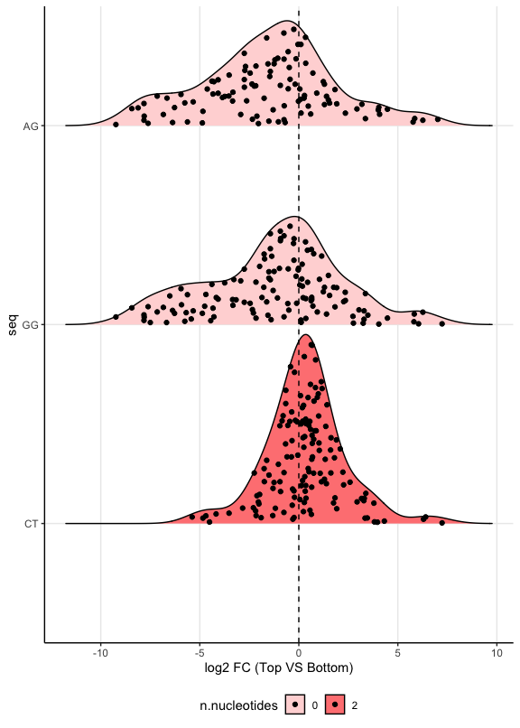

``` r
ggsave("./Figs/Ridgeplots_dimers_CT_HeLa.pdf", height = 4, width = 4, scale = 1.2)

wilcox.seqs %>% 
  mutate(seq = reorder(seq, -log2topVSbot, FUN = get_top),
         n.nucleotides = as.factor(str_count(seq, "C|T"))) %>% 
ggplot(aes(x = log2topVSbot, y = seq, fill = n.nucleotides))+
  geom_density_ridges(panel_scaling = T, jittered_points = TRUE,  scale = 0.95)+
  scale_fill_manual(values = c("#ffd8d8","#ff8383","#fc3a3a"))+
  theme_classic()+
  theme(panel.grid.major = element_line(), legend.position = "bottom")+
  geom_vline(xintercept = 0, linetype = "dashed", color = "black")+
  labs(x = "log2 FC (Top VS Bottom)")
```

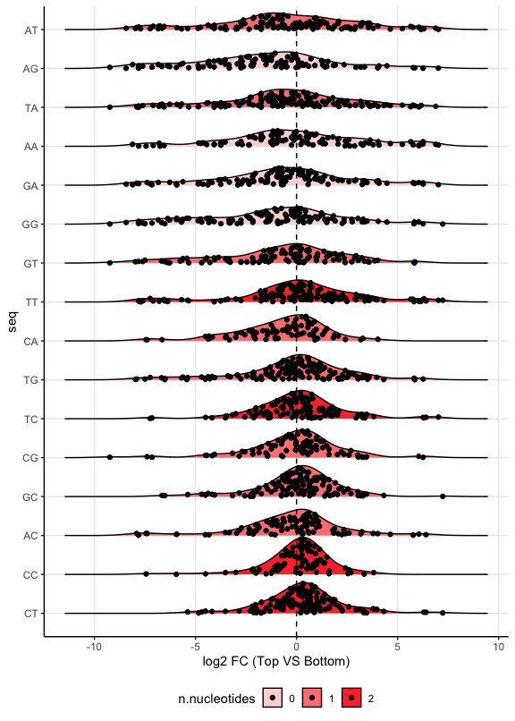

``` r
ggsave("./Figs/Ridgeplots_dimers_CT_HeLa_all.pdf", height = 8, width = 4, scale = 1.2)
```

## Content analysis

Check occurrence of CT’s or TC’s and AG’s or GA’s within the motif

``` r
aligned %>% 
  mutate(CT = as.factor(str_count(Motif, "CT|TC"))) %>% 
  mutate(log2topVSbot = log2(HiHi/LoLo)) %>% 
ggplot(aes(x = CT, y = log2topVSbot, fill = CT))+
  geom_violin(scale = "width")+
  geom_jitter(width = 0.2)+
  scale_fill_manual(values = c("#fdf0f0","#ffc9c9","#ff8383","#fc3a3a"))+
  stat_compare_means(ref.group = "0")+
  theme_classic()+
  theme(panel.grid.major.y = element_line(),legend.position="none", plot.title = element_text(hjust = 0.5))
```

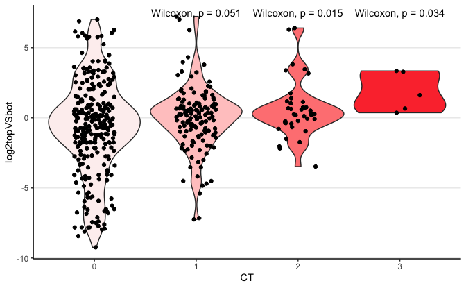

``` r
ggsave("./Figs/Violin_content_CT_TC_HeLa.pdf", height = 4, width = 6, scale = 1.2)


aligned %>% 
  mutate(AG = as.factor(str_count(Motif, "AG|GA"))) %>% 
  mutate(log2topVSbot = log2(HiHi/LoLo)) %>%
ggplot(aes(x = as_factor(AG), y = log2topVSbot, fill = AG))+
  geom_violin(scale = "width")+
  geom_jitter(width = 0.2)+
  scale_fill_manual(values = c("#e9e9ff","#b3b4fe","#7779ff","#3a3cfc"))+
  stat_compare_means(ref.group = "0")+
  theme_classic()+
  theme(panel.grid.major.y = element_line(),legend.position="none", plot.title = element_text(hjust = 0.5))
```

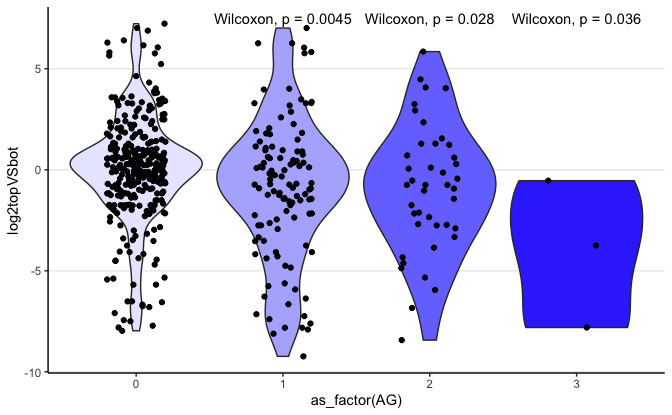

``` r
ggsave("./Figs/Violin_content_AG_GA_HeLa.pdf", height = 4, width = 6, scale = 1.2)
```

Check occurrence of C’s or T’s and A’s or G’s within the motif

``` r
col.pal <- colorRampPalette(c("#fdf0f0", "#fc3a3a"))(100)[seq(1, 100, length.out = 8)]

aligned %>% 
  separate(Motif, into = c("oligo", "nr", "Motif")) %>% 
  mutate(CT = as.factor(str_count(Motif, "C|T"))) %>% 
  mutate(log2topVSbot = log2(HiHi/LoLo)) %>% 
ggplot(aes(x = CT, y = log2topVSbot, fill = CT))+
  geom_violin()+
  geom_jitter(width = 0.2)+
  scale_fill_manual(values = col.pal)+
  stat_compare_means(ref.group = "0")+
  theme_classic()+
  theme(panel.grid.major.y = element_line(),legend.position="none", plot.title = element_text(hjust = 0.5))
```

    ## Warning: Groups with fewer than two data points have been dropped.

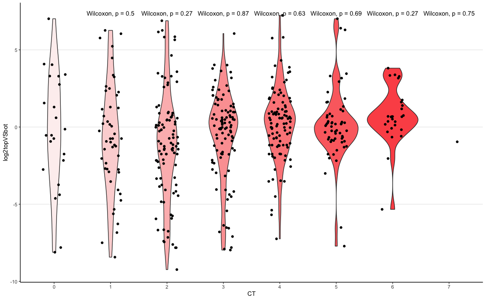

``` r
ggsave("./Figs/Violin_content_C_T_HeLa.pdf", height = 4, width = 10, scale = 1.2)
```

    ## Warning: Groups with fewer than two data points have been dropped.

``` r
col.pal <- colorRampPalette(c("#e9e9ff", "#3a3cfc"))(100)[seq(1, 100, length.out = 7)]

aligned %>% 
  separate(Motif, into = c("oligo", "nr", "Motif")) %>% 
  mutate(AG = as.factor(str_count(Motif, "A|G"))) %>% 
  mutate(log2topVSbot = log2(HiHi/LoLo)) %>% 
ggplot(aes(x = as_factor(AG), y = log2topVSbot, fill = AG))+
  geom_violin()+
  geom_jitter(width = 0.2)+
  scale_fill_manual(values = col.pal)+
  stat_compare_means(ref.group = "0")+
  theme_classic()+
  theme(panel.grid.major.y = element_line(),legend.position="none", plot.title = element_text(hjust = 0.5))
```

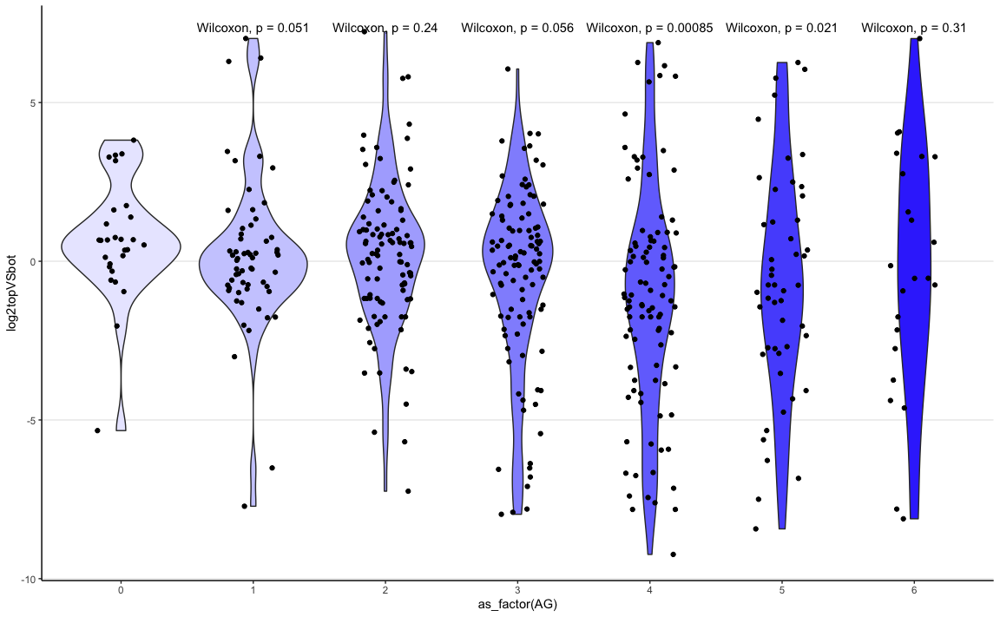

``` r
ggsave("./Figs/Violin_content_A_G_HeLa.pdf", height = 4, width = 10, scale = 1.2)
```
